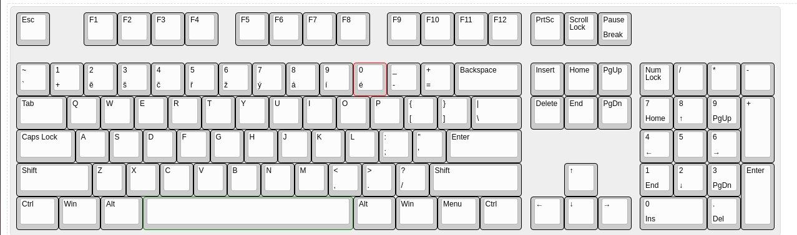

# my-keyboard-layout_cz

This is a QWERTY US layout with a number row from the CZ layout

## Showcase



## Installation

```bash
git clone https://github.com/Adamekka/my-keyboard-layout_cz
cd my-keyboard-layout_cz/
sudo cp zz /usr/share/X11/xkb/symbols/zz
```

## Setting up

To set my layout run

```bash
setxkbmap zz
```

To set US layout run

```bash
setxkbmap us
```
